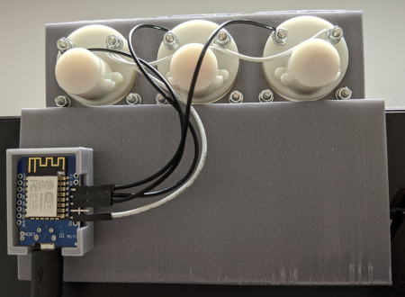
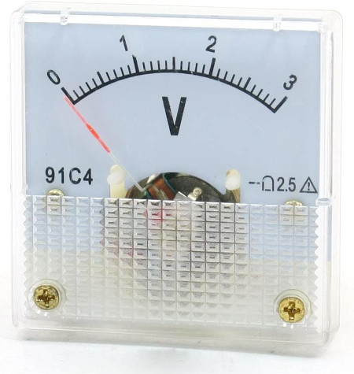
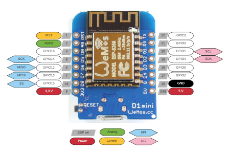
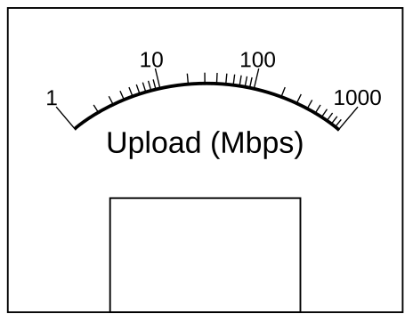

# Speedometer
#### An analog upload/download throughput meter using analog voltmeters as displays.

This project uses an ESP8266 microcontroller to drive three analog voltmeters that reflect an Internet connection's upload and download traffic in real time, plus the router's load average.

The speed and load average values are read by the ESP through SNMP, so it's not necessary to have any kind of physical connection to the router.

Initially I wanted to measure the router's temperature but my router's implementation of SNMP doesn't report that, so I had to settle for Load Average instead.

## Hardware

The hardware itself is very simple. I used a set of panel DC 0-3V voltmeters and drove them with the ESP8266's own PWM ("Analog") outputs, so beyond the microcontroller and the voltmeters, the only other hardware was four pieces of wire.

#### Voltmeter

To build my project I bought 4 Uxcell DC 0-3V voltmeters, and I used one as a reference to build the new scales. These aren't super precise, but are good enough (and cheap enough). If you don't have these exact ones, any DC 0-3V voltmeter should work but you will need to re-do the scales.

The ESP8266 model I used was a Wemos D1 Mini, of which I had a few around and are cheap enough to buy in bulk.

I used I/O pins 0, 4 and 5. In the D1 Mini these lines are labeled D3, D2 and D1 respectively but in other ESP models they may be labeled differently. Check your model's documentation.

Finally, I chose to make the upload and download scales logarithmic to have good resolution at the lower end of the scale. 1 or 2 Mbps are important if the total traffic is in the single-digit Mbps, but above 50 or 100Mbps it does not make any difference.

A logarithmic scale gives adequate context at all speeds.

One detail about the logarithmic scale is that it starts at 1Mbps, because Log10(1) is 0, and having the scale start at 0 would have needed a bunch of code that I was not in the mood of writing. So there.

## Software

The software that runs in the ESP8266 queries a router's interface statistics and load average via SNMP and uses the values to update the ESP's analog outputs.

The "SNMP client" itself is very rudimentary to the point of being almost nonexistent. The request itself is hard-coded as a byte array and sent verbatim to the router twice per second.

Responses are parsed with a basic ASN.1 parser that implements the bare minimum intelligence to identify the OID's for the three data points and their values.

Most of the code deals with the complexity of:
1. Handling counters larger than 32-bits on a 32-bit platform where they hit some undocumented corner cases in the compiler.
1. Driving physical objects, with inertia, from signals that can change drastically from one instant to the next.

To deal with the second case I chose to not update the analog outputs directly with each new value from the router, but to smooth out the changes over time to avoid having the voltmeters' needles move too fast and go beyond the end of the scale.

### build

To build the software I used Arduino IDE with the following settings:

* Board: ESP12E
* Builtin LED: 2
* Upload Speed: 230400
* CPU Frequency: 160MHz
* Flash Size: 4MB (FS: None)
* Debug Port: Disabled
* Debug Level: None
* lwIP Variant: V2 Higher bandwidth (No features)
* VTables: Flash
* Exceptions: Enabled
* Erase Flash: All Contents
* SSL Support: Basic SSL Ciphers

## Scale

I also included a SVG file (scales.svg) with ready-to-use scales that you can print and glue to the back of your voltmeters if you choose to use the same model I use.

## Dashboard structure

Finally, I'm including the FreeCad design for the 3d-printed support I used to mount the whole thing (dashboard.FCStd). I built this structure to mount it on top of my monitor (Asus VN279Q) so I doubt it'll be useful for many people, but inside the design there is a sketch with all the dimensions and positions of the holes necessary to mount the voltmeters. So maybe you can adapt that part to your own design.
